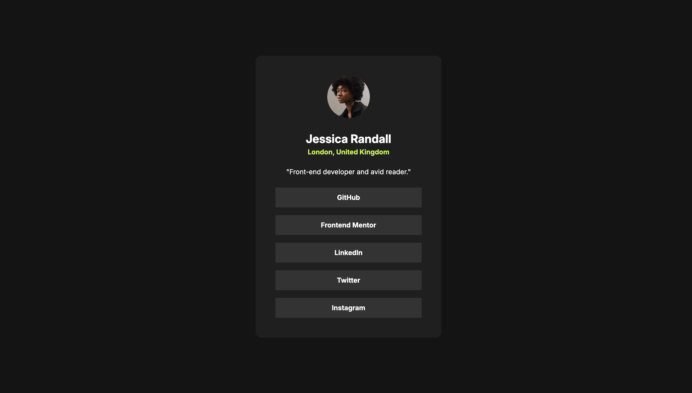
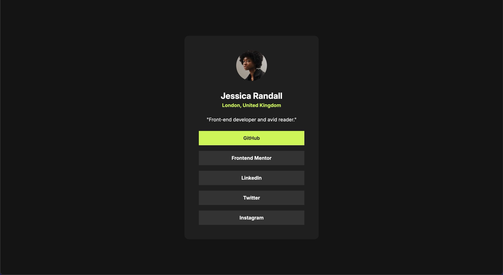
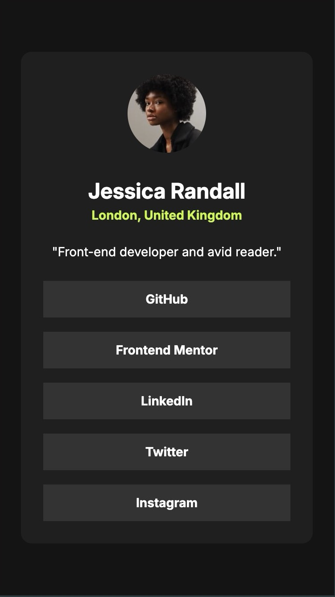
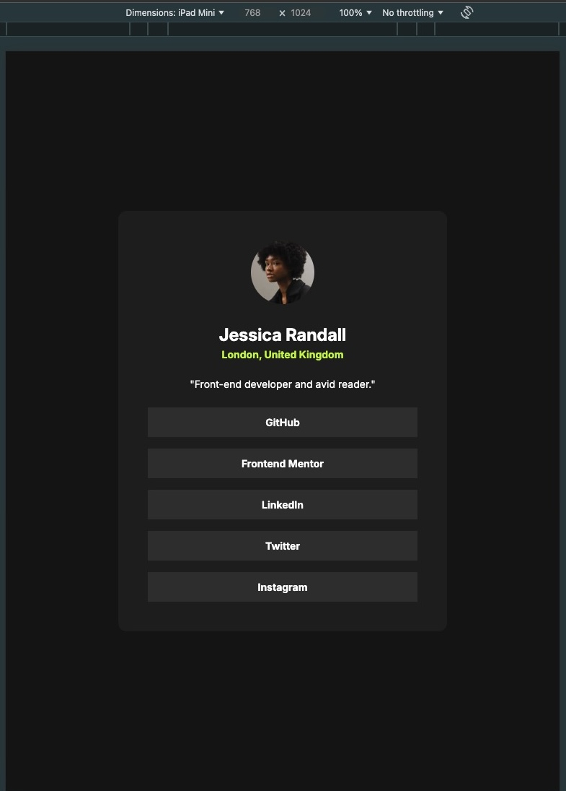

# Frontend Mentor - Social Link Profile

[Social Link Profile Solution](https://www.frontendmentor.io/challenges/social-links-profile-UG32l9m6dQ)

## Overview

### Links

- [Solution](https://github.com/Lokesh8055/social-link-profile)
- [LiveSite](https://social-link-profile-lp.netlify.app)

### Screenshot






## My process

### Built with

- Semantic HTML5 markup
- CSS custom properties
- FlexBox
- Mobile-first workflow

### What I learned

Learned about using media queries for different screens

```css
@media screen and (max-width: 500px) {
  .socialProfile {
    width: 20.438rem;
    padding: 1.5rem;
  }
}

@media screen and (min-width: 768px) and (max-width: 1024px) {
  .socialProfile {
    width: 28.5rem;
  }
}
```

### Continued development

Will continue my focus on responsive web design principles in next projects

## Author

- Frontend Mentor - [@Lokesh8055](https://www.frontendmentor.io/profile/Lokesh8055)
